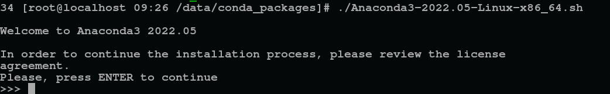
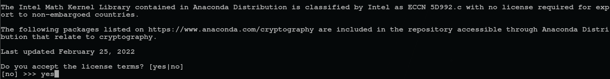
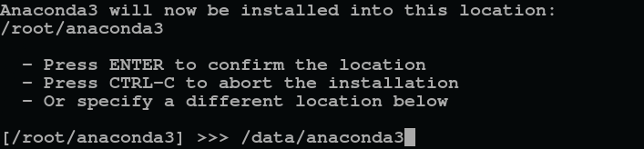
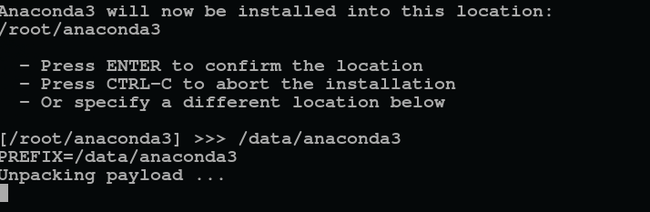
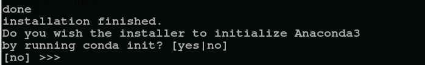

## How to install miniconda to use **conda** command
### 1. Download Miniconda Installer
* Go to https://www.anaconda.com/download/  ,then download the '64-Bit (x86) Installer' (Take the Linux system as an example, and so on)
### 2. Download Miniconda Installer 
* Download Miniconda Installer 
* Upload the 'Miniconda3-2022.05-Linux-x86_64.sh'file into the server using SSH tool (e.g. Filezilla/Xshell)
* Click enter

* Select yes to accept the license terms

* Enter the conda installation path


* Initialize the environment

* Testing the installation
  
    conda -V


------
## Virtual Environment Management
* List existing environments:
```
conda info --env
```
```
conda env list
```

* Create a new environment (specify Python version, e.g., Python 3.6):
```
conda create --name env_name python=3.6
```

* Create an environment with specific packages (you can also specify package versions):
```
conda create --name env_name python=3.7 numpy scrapy
```

* Activate conda:
```
source activate
```

* Deactivate conda:
```
$ source deactivate
```

* Activate a specific environment:
```
activate env_name
```

* Deactivate the current virtual environment:
```
conda deactivate
```

* Clone an environment:
```
conda create --name new_env_name --clone old_env_name
```

* Delete an environment:
```
conda remove --name env_name --all
```

* Remove a specific package from an environment:
```
conda remove --name env_name package_name
```

* Generate a YAML file to share your environment (run this inside the virtual environment):
```
conda env export > environment.yml
```

* Create a virtual environment from a shared YAML file:
```
conda env create -f environment.yml
```
